# Control de calidad de imagen planar con Pylinac

**Fundamento teórico del examen de Física Médica: análisis de un fantoma planar (Leeds TOR) con el módulo *Planar Imaging* de pylinac**

---

## Índice

1. [Objetivo](#1-objetivo)
2. [Contexto clínico: ¿por qué controlar la calidad de imagen?](#2-contexto-clínico-por-qué-controlar-la-calidad-de-imagen)
3. [Formación de la imagen planar](#3-formación-de-la-imagen-planar)
4. [Parámetros de calidad de imagen](#4-parámetros-de-calidad-de-imagen)
5. [El fantoma Leeds TOR](#5-el-fantoma-leeds-tor)
6. [Cómo trabaja pylinac (algoritmo)](#6-cómo-trabaja-pylinac-algoritmo)
7. [El código del examen](#7-el-código-del-examen)
8. [Resultados obtenidos](#8-resultados-obtenidos)
9. [Interpretación y conclusiones](#9-interpretación-y-conclusiones)
10. [Versión 2: alto contraste, Las Vegas y SNC](#10-versión-2-alto-contraste-las-vegas-y-snc)
11. [Preguntas de repaso para el examen](#11-preguntas-de-repaso-para-el-examen)
12. [Cómo reproducir este trabajo](#12-cómo-reproducir-este-trabajo)
13. [Referencias](#13-referencias)
14. [Anexo: capturas de la ejecución en mi computadora](#14-anexo-capturas-de-la-ejecución-en-mi-computadora)

---

## 1. Objetivo

Verificar de forma **objetiva, cuantitativa y repetible** la calidad de imagen de un sistema de imagen planar (panel kV o EPID MV de un acelerador lineal) mediante el análisis automático de la radiografía de un fantoma de calidad de imagen con la librería de Python **pylinac**.

En concreto, a partir de una sola imagen del fantoma **Leeds TOR** se miden:

| Magnitud | Qué evalúa |
|---|---|
| Contraste de bajo contraste y CNR | Capacidad de distinguir objetos de densidad parecida al fondo |
| Visibilidad (criterio de Rose) | Si un objeto de bajo contraste es perceptible a pesar del ruido |
| rMTF (pares de líneas) | Resolución espacial: el detalle más pequeño que se distingue |
| Uniformidad (PIU) | Homogeneidad de la señal dentro de las regiones medidas |
| Centro y área del fantoma | Posición y escala (comprobación geométrica) |

---

## 2. Contexto clínico: ¿por qué controlar la calidad de imagen?

En radioterapia moderna el paciente se posiciona con **radioterapia guiada por imagen (IGRT)**: antes de tratar, se adquieren imágenes planares kV (sistema de imagen montado en el acelerador) o MV (EPID, *Electronic Portal Imaging Device*, que usa el propio haz de tratamiento) y se comparan con las referencias de la planificación (DRR). Si la calidad de imagen se degrada (más ruido, menos contraste, menos resolución), la localización de estructuras óseas, marcadores fiduciales o tejidos blandos pierde exactitud, y con ello la precisión de la dosis entregada.

Por eso los protocolos internacionales, en particular el **AAPM TG-142** (control de calidad de aceleradores lineales) y el **AAPM TG-58** (uso clínico de EPID), recomiendan pruebas periódicas de calidad de imagen planar que incluyen **resolución espacial, contraste, ruido y uniformidad**, comparando siempre con una **línea base** obtenida en la aceptación del equipo.

Hacer estas pruebas "a ojo" (contar cuántos discos se ven) es subjetivo y depende del observador, del monitor y de la ventana de visualización. Pylinac automatiza el análisis y da números reproducibles.

---

## 3. Formación de la imagen planar

### 3.1 Atenuación de los rayos X

Una imagen planar es un mapa 2D de la intensidad transmitida a través del objeto. Para un haz monoenergético estrecho se cumple la ley de **Beer-Lambert**:

$$
I = I_0 \, e^{-\int \mu(x)\,dx}
$$

donde $I_0$ es la intensidad incidente y $\mu$ el coeficiente lineal de atenuación del material. El **contraste** en la imagen aparece porque distintos materiales (o espesores) atenúan de forma distinta.

### 3.2 kV frente a MV

| | Imagen kV (≈ 70–140 kVp) | Imagen MV (≈ 6 MV) |
|---|---|---|
| Interacción dominante | Efecto fotoeléctrico ($\propto Z^3/E^3$) y Compton | Casi solo Compton (depende de la densidad electrónica, no de $Z$) |
| Contraste hueso/tejido | Alto | Bajo |
| Ruido / dosis | Menor dosis para buena imagen | Mayor dosis, imagen más "plana" |
| Uso | Posicionamiento diario (kV 2D, CBCT) | Verificación portal, posicionamiento |

Por esta física, un mismo fantoma da **menos discos visibles en MV que en kV**, y por eso pylinac tiene clases distintas para fantomas kV y MV.

### 3.3 El detector de panel plano

Los paneles modernos son de **silicio amorfo (a-Si)** con conversión indirecta: un centelleador (CsI:Tl o Gd₂O₂S) convierte los rayos X en luz y una matriz de fotodiodos y transistores (TFT) convierte la luz en carga, que se digitaliza píxel a píxel. El tamaño del píxel, el espesor del centelleador (dispersión de la luz) y el ruido electrónico limitan la resolución y el contraste que veremos en las pruebas.

La imagen demo analizada aquí tiene **768 × 1024 píxeles** con **3.86 píxeles/mm** (≈ 0.26 mm por píxel). La máxima frecuencia que puede representar el muestreo (**frecuencia de Nyquist**) es:

$$
f_N = \frac{1}{2\,\Delta x} \approx \frac{1}{2 \times 0.259\ \text{mm}} \approx 1.9\ \text{lp/mm}
$$

Esto explica por qué el último grupo de barras analizado (1.8 lp/mm) ya casi no se resuelve (ver sección 8.4). *(Este valor es una estimación a partir del tamaño de píxel de la imagen.)*

---

## 4. Parámetros de calidad de imagen

### 4.1 Contraste

El contraste mide cuánto se diferencia la señal de un objeto de la de su fondo. Existen varias definiciones; pylinac usa por defecto la de **Michelson** para las regiones de bajo contraste:

$$
C_{\text{Michelson}} = \frac{I_{\max} - I_{\min}}{I_{\max} + I_{\min}}
$$

donde, para cada disco, los dos valores son la señal media del disco (ROI) y la señal media de las **ROIs de referencia de fondo** (LCR). Varía entre 0 (sin diferencia) y 1.

Otras definiciones disponibles en pylinac (parámetro `low_contrast_method`):

- **Weber**: $C = \dfrac{|I_{\text{obj}} - I_{\text{fondo}}|}{I_{\text{fondo}}}$, adecuada para un objeto pequeño sobre un fondo grande.
- **Ratio**: $C = I_{\text{obj}} / I_{\text{fondo}}$.
- **RMS**: desviación cuadrática media de la señal normalizada.

### 4.2 Ruido, SNR y CNR

El **ruido** es la fluctuación aleatoria de la señal; se cuantifica con la desviación estándar $\sigma$ de los píxeles dentro de una ROI. Su origen principal es cuántico (estadística de Poisson de los fotones detectados), más ruido electrónico del panel.

- **Relación señal-ruido**: $\text{SNR} = \dfrac{\bar{I}}{\sigma}$
- **Relación contraste-ruido**: $\text{CNR} = \dfrac{C}{\sigma}$

Un objeto puede tener contraste distinto de cero y aun así no verse si el ruido lo "tapa". Por eso el CNR es más representativo de la detectabilidad que el contraste solo.

### 4.3 Visibilidad: el criterio de Rose

Albert Rose (1948) mostró que la detectabilidad de un objeto depende no solo de su contraste y del ruido, sino también de su **tamaño**: un objeto grande integra más fotones y se detecta con menor contraste. Pylinac implementa una **visibilidad** basada en este modelo:

$$
V = \frac{C \,\sqrt{A}}{\sigma} = \frac{C\,\sqrt{\pi r^2}}{\sigma}
$$

donde $r$ es el radio de la ROI y $A$ su área.

> **Punto clave para el examen.** En pylinac 3.x, una ROI de bajo contraste se considera **"vista"** (círculo **verde**) cuando su visibilidad supera el umbral `visibility_threshold` (por defecto **100**). El número "*Low contrast ROIs seen*" es la cantidad de ROIs que cumplen esa condición. El parámetro `low_contrast_threshold = 0.05` es el umbral de **contraste** que se dibuja como línea horizontal en la gráfica, pero **el color verde/rojo lo decide la visibilidad**.
>
> Ejemplo real de este análisis: la ROI **LC10** tiene contraste 0.057 (> 0.05) pero visibilidad 67.6 (< 100), por eso sale **roja** aunque su punto quede ligeramente por encima de la línea de 0.05.

### 4.4 Resolución espacial y MTF

La resolución espacial es la capacidad de separar dos objetos pequeños próximos. Se describe con:

- **PSF** (*point spread function*): imagen de un punto.
- **LSF** (*line spread function*): imagen de una línea.
- **MTF** (*modulation transfer function*): fracción de la modulación (contraste) del objeto que el sistema transfiere a la imagen en función de la frecuencia espacial $f$. Formalmente, $\text{MTF}(f) = |\mathcal{F}\{\text{LSF}\}(f)|$, normalizada a 1 en $f = 0$.

La frecuencia espacial se expresa en **pares de líneas por milímetro (lp/mm)**: un par de líneas es una barra opaca más un espacio; 1 lp/mm significa barras de 0.5 mm separadas 0.5 mm.

Con patrones de barras no se calcula la MTF "verdadera" sino una **MTF relativa (rMTF)**. Para cada grupo de barras se mide la modulación con Michelson, usando el máximo y el mínimo de la ROI:

$$
M(f) = \frac{I_{\max}(f) - I_{\min}(f)}{I_{\max}(f) + I_{\min}(f)}
\qquad
\text{rMTF}(f) = \frac{M(f)}{M(f_{\text{menor}})}
$$

Es decir, se normaliza al grupo de barras más gruesas (0.5 lp/mm), que por eso vale 1.0. A medida que las barras se hacen más finas, el sistema las "emborrona" y la rMTF cae. El indicador habitual es la frecuencia a la que la rMTF cae al **50 %** (**MTF50**). En pylinac, un grupo de barras **pasa** si su rMTF ≥ `high_contrast_threshold` (0.5 por defecto).

### 4.5 Uniformidad (PIU)

La **uniformidad integral porcentual** (*Percent Integral Uniformity*, la misma idea que usa el ACR en CT) mide cuán homogénea es la señal:

$$
\text{PIU} = 100 \left(1 - \frac{I_{\max} - I_{\min}}{I_{\max} + I_{\min}}\right)
$$

Pylinac la calcula en cada ROI de bajo contraste usando los percentiles 1 y 99 como $I_{\min}$ e $I_{\max}$ (para no depender de un píxel aislado) y reporta el **peor valor** (el mínimo). Un 100 % sería una señal perfectamente uniforme.

---

## 5. El fantoma Leeds TOR

El **Leeds TOR** (Leeds Test Object, de Leeds Test Objects Ltd.) es un fantoma circular diseñado para pruebas de calidad de imagen en radiografía y fluoroscopía, y se usa también en paneles kV de aceleradores. Contiene:

- **Discos de bajo contraste** dispuestos en anillo, de contraste decreciente. Pylinac analiza **18 ROIs** (LC0 a LC17), de la más visible a la menos visible.
- **ROIs de referencia de fondo** (LCR0 a LCR3, círculos azules), contra las que se compara cada disco.
- Un bloque central con **grupos de pares de líneas** (patrón de barras de plomo). Pylinac analiza **12 grupos** (HC0 a HC11) de **0.5 a 1.8 lp/mm**: 0.5, 0.56, 0.63, 0.71, 0.8, 0.9, 1.0, 1.12, 1.25, 1.4, 1.6 y 1.8 lp/mm.
- Bordes y marcas que permiten determinar su posición y orientación.

A continuación, la radiografía kV de demostración que incluye pylinac, **antes del análisis**:

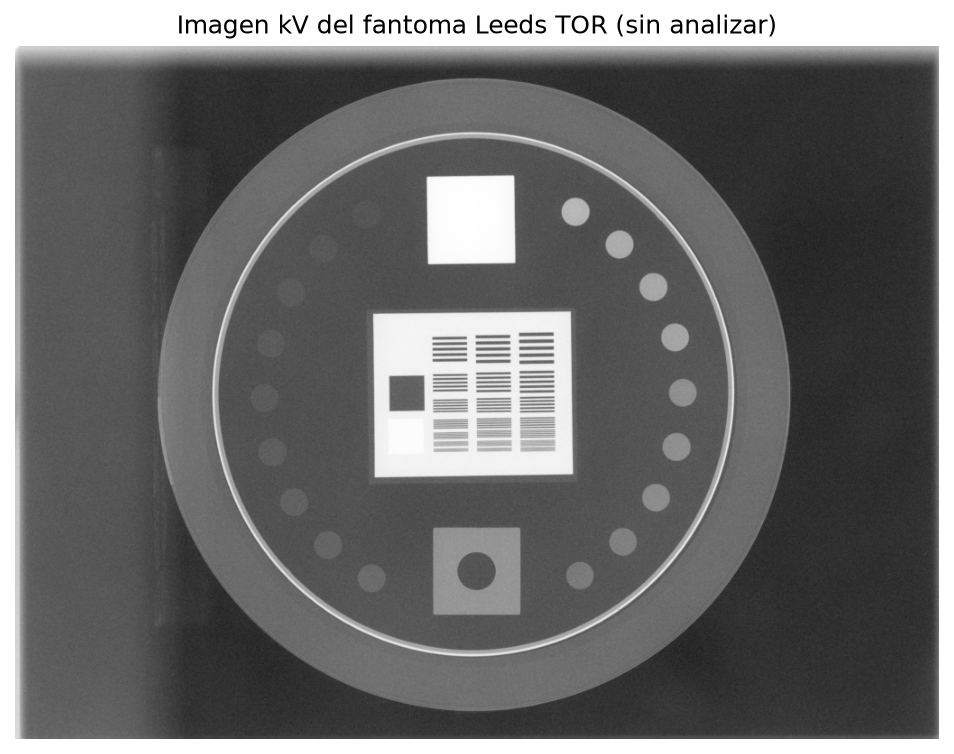

*Figura 1. Imagen kV del fantoma Leeds TOR (archivo demo `leeds.dcm` de pylinac) sin procesar. Se ven el anillo exterior del fantoma, los discos de bajo contraste en círculo, el cuadrado oscuro superior, el bloque central con los patrones de barras y el cuadrado inferior con un agujero.*

Pylinac incluye clases para otros fantomas planares que se usan **exactamente igual**: `LeedsTORBlue`, `StandardImagingQC3` (MV), `StandardImagingQCkV`, `LasVegas` y `ElektaLasVegas` (MV, solo bajo contraste), `DoselabMC2kV`, `DoselabMC2MV`, `SNCkV`, `SNCMV`, `PTWEPIDQC`, `IBAPrimusA`.

---

## 6. Cómo trabaja pylinac (algoritmo)

Cuando se llama a `analyze()`, pylinac sigue estos pasos:

1. **Carga de la imagen** DICOM (o de la demo) como una matriz de valores de píxel, con su tamaño de píxel.
2. **Detección del fantoma**: umbraliza la imagen y detecta bordes; luego busca la región conectada con el tamaño y forma esperados del fantoma. De ella obtiene el **centro**, el **radio** (que fija la escala) y el **ángulo de rotación**.
3. **Inversión** (opcional): si las intensidades están invertidas respecto a lo esperado, se puede forzar con `invert=True`.
4. **Escala por SSD**: con `ssd="auto"` pylinac estima la distancia fuente-superficie; si se conoce, se da en **milímetros**.
5. **Colocación de las ROIs**: todas las posiciones de las ROIs están definidas *relativas* al centro y radio del fantoma (ángulo y distancia), así que se ajustan automáticamente al tamaño, posición y giro reales.
6. **Mediciones**: en cada ROI de bajo contraste calcula señal media, $\sigma$, contraste, CNR y visibilidad; en cada ROI de alto contraste calcula máximo y mínimo para la rMTF; calcula la PIU.
7. **Evaluación**: compara con los umbrales (visibilidad para "vista", rMTF ≥ 0.5 para alto contraste) y asigna colores verde/rojo.
8. **Resultados**: texto (`results()`), datos estructurados (`results_data()`), figuras (`plot_analyzed_image()`, `save_analyzed_image()`) y reporte PDF (`publish_pdf()`).

---

## 7. El código del examen

El script completo está en [`planar_phantom.py`](planar_phantom.py). Su parte esencial es:

```python
from pylinac import LeedsTOR

Fantoma = LeedsTOR          # clase del fantoma que vas a analizar
RUTA_IMAGEN = None          # None = imagen demo. Ej: r"C:\examen\leeds.dcm"

UMBRAL_BAJO_CONTRASTE = 0.05   # contraste mínimo de referencia
UMBRAL_ALTO_CONTRASTE = 0.5    # rMTF mínimo para que una ROI "pase"
SSD = "auto"                   # distancia fuente-fantoma en mm, o "auto"
INVERTIR = False               # True si las ROIs salen giradas/desplazadas

# 1) Cargar
fantoma = Fantoma.from_demo_image() if RUTA_IMAGEN is None else Fantoma(RUTA_IMAGEN)

# 2) Analizar
fantoma.analyze(low_contrast_threshold=UMBRAL_BAJO_CONTRASTE,
                high_contrast_threshold=UMBRAL_ALTO_CONTRASTE,
                ssd=SSD, invert=INVERTIR)

# 3) y 4) Resultados en texto y numéricos
print(fantoma.results())
datos = fantoma.results_data()

# 5) Guardar imagen y reporte PDF
fantoma.save_analyzed_image("resultado_fantoma.png")
fantoma.publish_pdf("reporte_fantoma.pdf")

# 6) Mostrar la figura con imagen, bajo contraste y rMTF
fantoma.plot_analyzed_image(show_roi_labels=True)
```

| Parámetro | Significado | Valor usado |
|---|---|---|
| `low_contrast_threshold` | Umbral de contraste (línea horizontal de la gráfica de bajo contraste) | 0.05 |
| `high_contrast_threshold` | rMTF mínima para que un grupo de barras pase | 0.5 |
| `visibility_threshold` | Visibilidad mínima para que un disco cuente como "visto" | 100 (por defecto) |
| `ssd` | Distancia fuente-superficie en mm, para la escala | `"auto"` |
| `invert` | Fuerza la inversión de la imagen | `False` |

Las figuras de este documento se generaron con [`generar_figuras.py`](generar_figuras.py), que hace el mismo análisis con los mismos parámetros y guarda cada gráfica en alta resolución junto a este documento.

---

## 8. Resultados obtenidos

Análisis realizado con **pylinac 3.48.0** sobre la imagen demo del Leeds TOR. Los valores coinciden con los obtenidos al ejecutar el script en mi computadora (ver [Anexo](#14-anexo-capturas-de-la-ejecución-en-mi-computadora)).

### 8.1 Resumen numérico

Salida de `fantoma.results()`:

```
Leeds results:
Median Contrast: 0.11
Median CNR: 10.1
# Low contrast ROIs "seen": 10 of 18
Area: 17760.88 mm^2
MTF 80% (lp/mm): 1.14
MTF 50% (lp/mm): 1.63
MTF 30% (lp/mm): 1.79
```

| Resultado | Valor | Significado |
|---|---|---|
| Contraste mediano | 0.106 | Contraste típico de los 18 discos |
| CNR mediano | 10.1 | Contraste típico respecto al ruido |
| ROIs de bajo contraste vistas | **10 de 18** | Discos que superan el umbral de visibilidad |
| MTF80 | 1.14 lp/mm | Frecuencia a la que la rMTF cae al 80 % |
| **MTF50** | **1.63 lp/mm** | Indicador principal de resolución espacial |
| MTF30 | 1.79 lp/mm | Frecuencia a la que la rMTF cae al 30 % |
| Uniformidad (PIU) | 91.8 % | Peor uniformidad entre las ROIs de bajo contraste |
| Centro del fantoma (x, y) | (508.0, 385.5) px | Posición detectada |
| Área del fantoma | 17 760.9 mm² | Comprobación de escala |

### 8.2 Imagen analizada

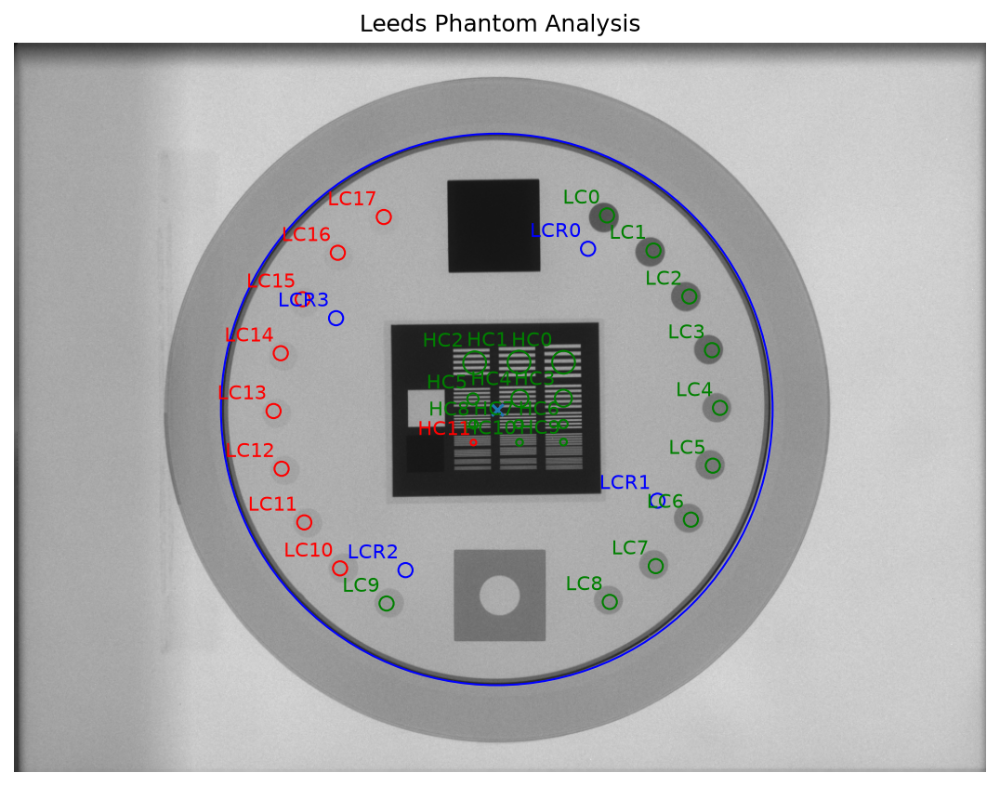

*Figura 2. Resultado del análisis sobre la imagen.*

Cómo leerla:

- **Círculo azul grande**: contorno del fantoma detectado por pylinac. Que coincida con el borde real del fantoma confirma que la detección (centro, radio y giro) fue correcta.
- **LC0 a LC17** (anillo de círculos pequeños): ROIs de bajo contraste. **Verde = vista**, **rojo = no vista**. Se ven LC0 a LC9 (10 discos, lado derecho) y fallan LC10 a LC17 (8 discos, lado izquierdo).
- **LCR0 a LCR3** (círculos azules pequeños): ROIs de referencia del fondo.
- **HC0 a HC11** (bloque central): grupos de pares de líneas. Verdes pasan; **HC11** (1.8 lp/mm, el más fino) está en rojo porque su rMTF es menor que 0.5.
- La **"x"** azul en el centro marca el centro detectado del fantoma.

### 8.3 Bajo contraste

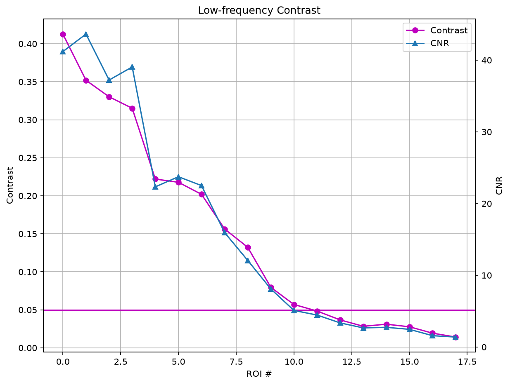

*Figura 3. Contraste (Michelson, eje izquierdo) y CNR (eje derecho) de cada ROI de bajo contraste. La línea horizontal es el umbral de contraste 0.05.*

Ambas curvas decrecen porque cada disco del fantoma está diseñado con menos contraste que el anterior. El CNR sigue la forma del contraste porque el ruido es parecido en todas las ROIs. La curva de contraste cruza la línea de 0.05 entre LC10 y LC11.

Valores por ROI:

| ROI | Contraste | CNR | Visibilidad | ¿Vista? |
|---|---|---|---|---|
| LC0 | 0.413 | 41.2 | 546.7 | Sí |
| LC1 | 0.352 | 43.6 | 579.0 | Sí |
| LC2 | 0.330 | 37.2 | 494.0 | Sí |
| LC3 | 0.315 | 39.0 | 518.2 | Sí |
| LC4 | 0.222 | 22.3 | 296.3 | Sí |
| LC5 | 0.218 | 23.7 | 315.1 | Sí |
| LC6 | 0.202 | 22.5 | 298.7 | Sí |
| LC7 | 0.156 | 16.0 | 211.7 | Sí |
| LC8 | 0.132 | 12.1 | 160.2 | Sí |
| LC9 | 0.080 | 8.1 | 107.4 | Sí |
| LC10 | 0.057 | 5.1 | 67.6 | No |
| LC11 | 0.048 | 4.5 | 59.2 | No |
| LC12 | 0.037 | 3.4 | 44.6 | No |
| LC13 | 0.028 | 2.7 | 35.4 | No |
| LC14 | 0.031 | 2.7 | 36.4 | No |
| LC15 | 0.028 | 2.5 | 32.7 | No |
| LC16 | 0.019 | 1.6 | 21.0 | No |
| LC17 | 0.014 | 1.4 | 18.5 | No |

### 8.4 Criterio de visibilidad (Rose)

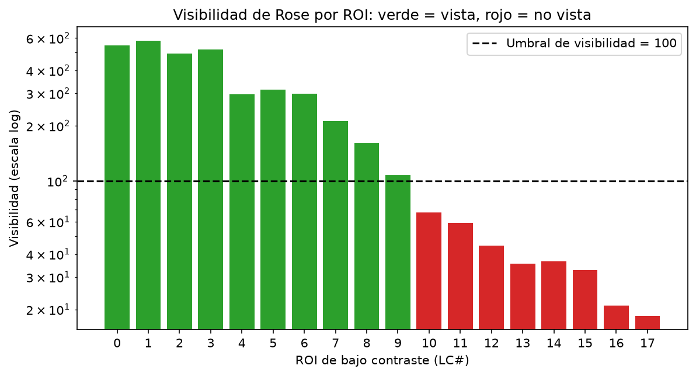

*Figura 4. Visibilidad de cada ROI de bajo contraste (escala logarítmica) frente al umbral de 100. Esta gráfica no la produce pylinac directamente; se construyó con los valores que pylinac calcula, para mostrar por qué cada disco sale verde o rojo.*

El corte entre "visto" y "no visto" está exactamente entre **LC9 (107.4)** y **LC10 (67.6)**, lo que explica los 10 de 18 discos vistos.

### 8.5 Resolución espacial (rMTF)

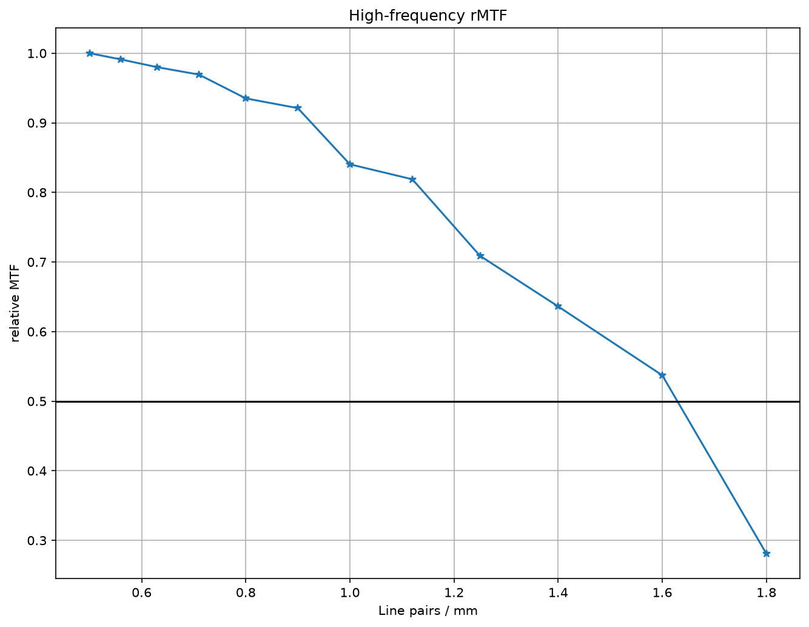

*Figura 5. MTF relativa frente a la frecuencia espacial. La línea horizontal es el umbral de 0.5.*

| lp/mm | 0.50 | 0.56 | 0.63 | 0.71 | 0.80 | 0.90 | 1.00 | 1.12 | 1.25 | 1.40 | 1.60 | 1.80 |
|---|---|---|---|---|---|---|---|---|---|---|---|---|
| rMTF | 1.000 | 0.991 | 0.980 | 0.969 | 0.935 | 0.921 | 0.840 | 0.819 | 0.709 | 0.636 | 0.537 | **0.281** |

La rMTF se mantiene por encima de 0.5 hasta 1.6 lp/mm (0.537) y cae a 0.281 en 1.8 lp/mm (falla). Interpolando entre ambos puntos, la **MTF50 = 1.63 lp/mm**: el panel transfiere al menos la mitad de la modulación para detalles de hasta unos **0.31 mm** (medio par de líneas a 1.63 lp/mm).

### 8.6 Figura resumen

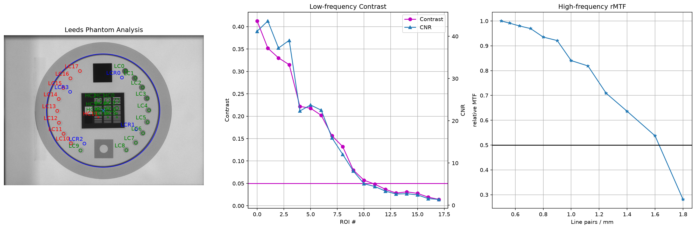

*Figura 6. Figura completa que produce `plot_analyzed_image(show_roi_labels=True)`: imagen analizada, bajo contraste y rMTF juntas. Es la misma ventana que abre el script del examen.*

---

## 9. Interpretación y conclusiones

1. **Detección correcta del fantoma.** El contorno azul coincide con el fantoma y las ROIs caen sobre los discos y las barras, así que las mediciones son válidas.
2. **Bajo contraste.** El sistema permite ver **10 de 18 discos**. El último disco visto (LC9) tiene contraste ≈ 0.08; por debajo de ese contraste el ruido impide distinguir los discos con este tamaño de ROI.
3. **Resolución espacial.** **MTF50 = 1.63 lp/mm**, con 11 de 12 grupos de barras aprobados. La caída fuerte cerca de 1.8 lp/mm es coherente con el límite de muestreo del detector (Nyquist ≈ 1.9 lp/mm para un píxel de ≈ 0.26 mm).
4. **Uniformidad.** PIU = 91.8 %, señal razonablemente homogénea dentro de las ROIs.
5. **Uso en control de calidad.** Estos números por sí solos no "aprueban" ni "reprueban" el equipo: según TG-142, se registran como **línea base** en la aceptación y en cada control periódico se comparan con ella. Una disminución en el número de discos vistos, en el CNR o en la MTF50 indicaría **degradación del panel** (envejecimiento del centelleador, píxeles defectuosos, problemas de calibración de ganancia/offset) o cambios en la técnica de adquisición (kVp, mAs, filtración).

**En una frase:** el módulo *Planar Imaging* de pylinac permite verificar de forma objetiva y repetible que la calidad de imagen del panel kV/MV se mantiene dentro de tolerancia, sustituyendo la evaluación visual subjetiva por métricas físicas (contraste, CNR, visibilidad, rMTF y uniformidad).

---

## 10. Versión 2: alto contraste, Las Vegas y SNC

### 10.1 Por qué hizo falta una versión 2

El profesor observó que el análisis solo cubría **bajo contraste** y que en el hospital se usa el fantoma **Las Vegas** y equipos **SNC** (Sun Nuclear). Según la documentación de pylinac:

- El **Las Vegas** es un fantoma "for MV image quality testing and includes low contrast regions of varying contrast and size". Solo tiene agujeros de distinta profundidad y diámetro (**contraste-detalle**), **no tiene pares de líneas**. Por eso pylinac **no calcula rMTF** con él: en el código, la clase `LasVegas` no define ROIs de alto contraste. Con este fantoma el alto contraste **no se puede evaluar**, no es un fallo del script.
- Los fantomas **SNC kV-QA** y **SNC MV-QA** "include low and high contrast regions": tienen 4 ROIs de bajo contraste (LC0 a LC3) y 4 grupos de pares de líneas (HC0 a HC3), cuya rMTF se calcula por el método pico-valle. En pylinac son las clases `SNCkV`, `SNCMV` y `SNCMV12510` (modelo antiguo 1251000). El `SNCFSQA`, también de SNC, es de coincidencia luz/radiación, no de calidad de imagen.

Conclusión: el control completo de un EPID MV combina **Las Vegas para bajo contraste** y **SNC MV-QA para alto contraste** (o un fantoma con ambos, como Leeds TOR o SNC kV-QA para el panel kV).

### 10.2 Qué añade `planar_phantom_v2.py`

El script [`planar_phantom_v2.py`](planar_phantom_v2.py) mantiene el mismo análisis y agrega:

1. **Varios fantomas en una sola corrida**, definidos en la lista `ANALISIS` (por defecto: Leeds TOR, SNC kV-QA, SNC MV-QA y Las Vegas).
2. **Aviso explícito** cuando un fantoma no tiene alto contraste ("ALTO CONTRASTE: NO EVALUADO").
3. **Alto contraste completo**: rMTF de cada grupo de barras con PASA/falla frente al umbral 0.5, y las frecuencias a las que la rMTF cae al 80, 50 y 30 %.
4. **Umbral de visibilidad configurable** (`UMBRAL_VISIBILIDAD = 100`, criterio de Rose) y una tabla por ROI con contraste, CNR, visibilidad y si se ve.
5. **Comparación con línea base** (TG-142): cada fantoma se compara con sus valores de referencia (`LINEA_BASE`) con tolerancias de ±10 % en MTF50, −1 ROI vista y ±2 puntos de PIU, y se da un veredicto global PASA/FALLA.

Si una imagen no se puede analizar, el script lo informa y sigue con los demás fantomas.

### 10.3 Resultados con las imágenes demo

```
Fantoma              LC vistas  MTF50 lp/mm  PIU %   Veredicto
Leeds                10/18      1.63         91.8    PASA
SNC kV-QA            4/4        1.70         98.7    PASA
SNC MV-QA            3/4        0.47         98.4    PASA
Las Vegas            12/20      no evaluado  98.4    PASA
```

Las líneas base del script son estos mismos valores demo, por eso todo sale PASA. Con imágenes reales del hospital se reemplazan por los valores medidos en la puesta en marcha.

Detalle del alto contraste del **SNC MV-QA** (umbral 0.5):

| ROI | lp/mm | rMTF | Resultado |
|---|---|---|---|
| HC0 | 0.10 | 1.000 | PASA |
| HC1 | 0.20 | 0.889 | PASA |
| HC2 | 0.50 | 0.451 | falla |
| HC3 | 1.00 | 0.165 | falla |

rMTF 80 % = 0.26 lp/mm, rMTF 50 % = 0.47 lp/mm, rMTF 30 % = 0.76 lp/mm. Son valores mucho menores que en kV (MTF50 = 1.63 lp/mm en Leeds), lo esperable en MV: el haz de megavoltaje y la placa de cobre del EPID dispersan más y empeoran la resolución.

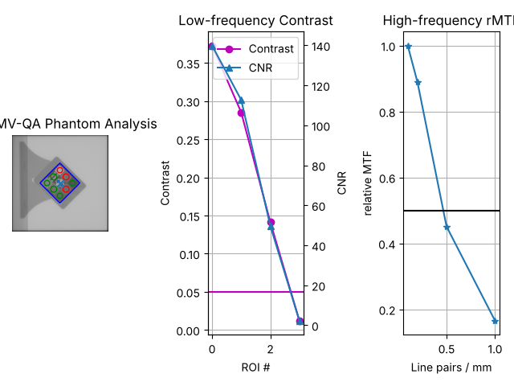

*Figura 7. SNC MV-QA (imagen demo) analizado con `planar_phantom_v2.py`: imagen con ROIs, bajo contraste y rMTF. A diferencia del Las Vegas, aparece la gráfica de alto contraste.*

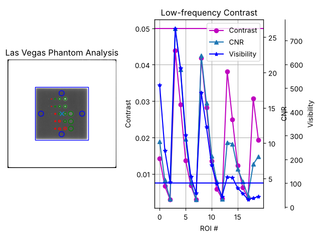

*Figura 8. Las Vegas (imagen demo): solo aparecen la imagen y la gráfica de bajo contraste (20 ROIs, 12 vistas). No hay gráfica de rMTF porque el fantoma no tiene pares de líneas.*

---

## 11. Preguntas de repaso para el examen

**¿Cuál es la finalidad del código?**
Realizar el control de calidad de imagen de un sistema de imagen planar (kV o EPID MV) analizando automáticamente la imagen de un fantoma, y obtener métricas de bajo contraste, resolución espacial y uniformidad comparables en el tiempo.

**¿Qué diferencia hay entre contraste y CNR?**
El contraste es la diferencia relativa de señal entre objeto y fondo; el CNR divide ese contraste por el ruido. Dos imágenes con el mismo contraste pueden tener distinta detectabilidad si una es más ruidosa.

**¿Por qué LC10 sale en rojo si su contraste (0.057) es mayor que 0.05?**
Porque en pylinac 3.x el criterio de "visto" es la **visibilidad de Rose** ($V = C\sqrt{A}/\sigma$), con umbral 100, y LC10 tiene $V = 67.6$.

**¿Qué es la MTF y qué significa MTF50 = 1.63 lp/mm?**
La MTF describe qué fracción de la modulación del objeto se transfiere a la imagen en función de la frecuencia espacial. MTF50 = 1.63 lp/mm significa que a esa frecuencia el sistema conserva el 50 % de la modulación que conserva para barras gruesas.

**¿Por qué la rMTF del primer grupo vale exactamente 1?**
Porque es una MTF *relativa*: todas las modulaciones se normalizan a la del grupo de menor frecuencia (0.5 lp/mm).

**¿Por qué las imágenes MV tienen menos contraste que las kV?**
Porque a energías de MV domina el efecto Compton, que depende de la densidad electrónica y no del número atómico; en kV contribuye el efecto fotoeléctrico ($\propto Z^3$), que aumenta mucho las diferencias entre materiales.

**¿Qué limita la resolución de un panel plano?**
El tamaño del píxel (frecuencia de Nyquist), la dispersión de la luz en el centelleador, el tamaño del punto focal y la dispersión del haz.

**¿Qué pasa si las ROIs salen desplazadas o giradas?**
La detección del fantoma falló o la imagen está invertida: se prueba `invert=True`, se verifica que el fantoma esté centrado y no toque los bordes de la imagen, y se da la SSD correcta en milímetros.

**¿Por qué con el fantoma Las Vegas no sale alto contraste?**
Porque el Las Vegas solo tiene agujeros de contraste-detalle y no tiene pares de líneas; pylinac no define ROIs de alto contraste para él y no calcula rMTF. El alto contraste se evalúa con otro fantoma, por ejemplo el SNC MV-QA (`SNCMV`).

**¿Cómo se analiza otro fantoma?**
Cambiando la clase (`Fantoma = StandardImagingQC3`, `LasVegas`, etc.); los métodos `analyze()`, `results()`, `plot_analyzed_image()` y `publish_pdf()` son los mismos.

---

## 12. Cómo reproducir este trabajo

Requisitos: Python 3.10 o superior.

```bash
python -m pip install -r requirements.txt

# Script del examen (muestra la ventana con las gráficas, crea PNG y PDF)
python planar_phantom.py

# Versión 2: varios fantomas, alto contraste y comparación con línea base
python planar_phantom_v2.py

# Regenera todas las figuras de este documento
python generar_figuras.py
```

La primera ejecución necesita internet porque pylinac descarga las imágenes demo (`leeds.dcm` y, en la versión 2, también las de SNC y Las Vegas).

Estructura del repositorio:

```
.
├── README.md                 # este documento
├── requirements.txt
├── planar_phantom.py         # script del examen
├── planar_phantom_v2.py      # versión 2: varios fantomas + línea base
├── generar_figuras.py        # genera las figuras del documento
├── 01_imagen_cruda.png … 06_visibilidad_rose.png   # figuras de pylinac
├── 07_snc_mv_analizada.png, 08_las_vegas_analizada.png  # figuras de la versión 2
└── captura_*.png                                  # capturas de mi ejecución
```

---

## 13. Referencias

1. Kerns, J. *pylinac: Planar Imaging module documentation.* https://pylinac.readthedocs.io/en/latest/planar_imaging.html
2. Klein, E. E. et al. (2009). *Task Group 142 report: Quality assurance of medical accelerators.* Medical Physics, 36(9), 4197–4212.
3. Herman, M. G. et al. (2001). *Clinical use of electronic portal imaging: Report of AAPM Radiation Therapy Committee Task Group 58.* Medical Physics, 28(5), 712–737.
4. Rose, A. (1948). *The sensitivity performance of the human eye on an absolute scale.* Journal of the Optical Society of America, 38(2), 196–208.
5. Bushberg, J. T., Seibert, J. A., Leidholdt, E. M., Boone, J. M. *The Essential Physics of Medical Imaging.* Lippincott Williams & Wilkins (capítulos de contraste, ruido y MTF).
6. Leeds Test Objects Ltd. *TOR 18FG test object.* https://www.leedstestobjects.com

---

## 14. Anexo: capturas de la ejecución en mi computadora

Ejecución de `planar_phantom.py` en Windows con VS Code y pylinac 3.48.0. Los resultados son idénticos a los de las figuras del documento.

**Imagen analizada (ventana "Figure 2")**

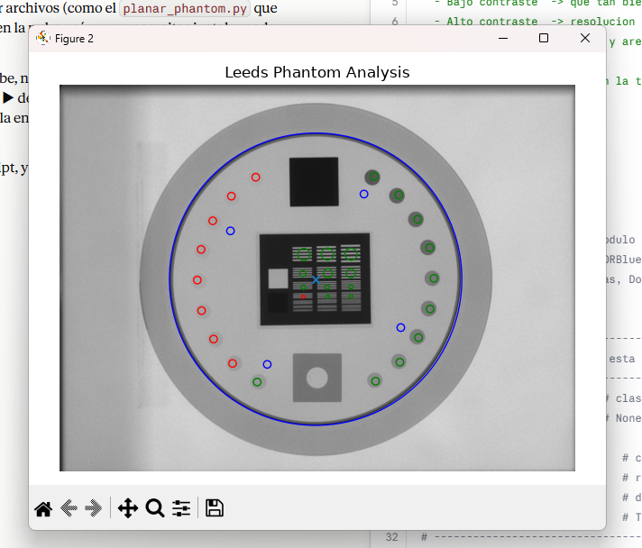

**Bajo contraste (ventana "Figure 4")**

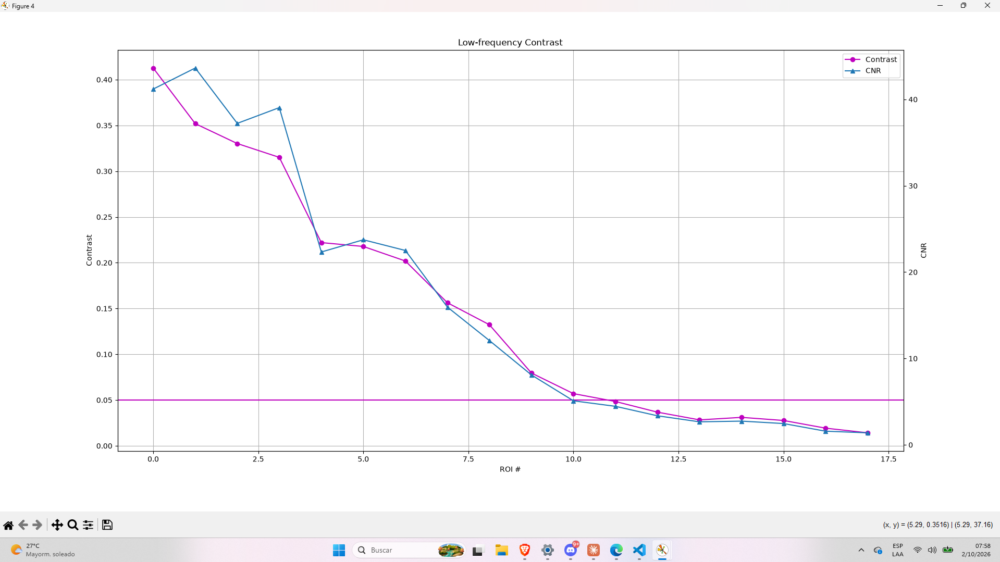

**rMTF (ventana "Figure 3")**

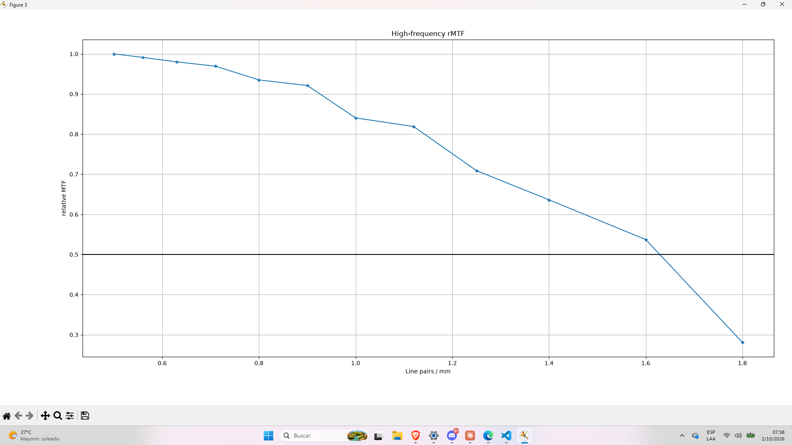

**Resumen (ventana "Figure 1")**

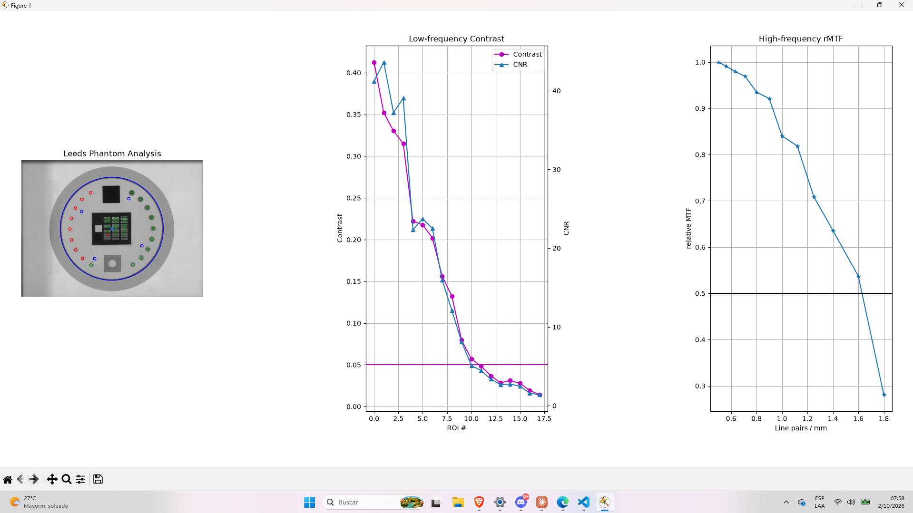

**Resumen con etiquetas de ROIs (ventana "Figure 5")**

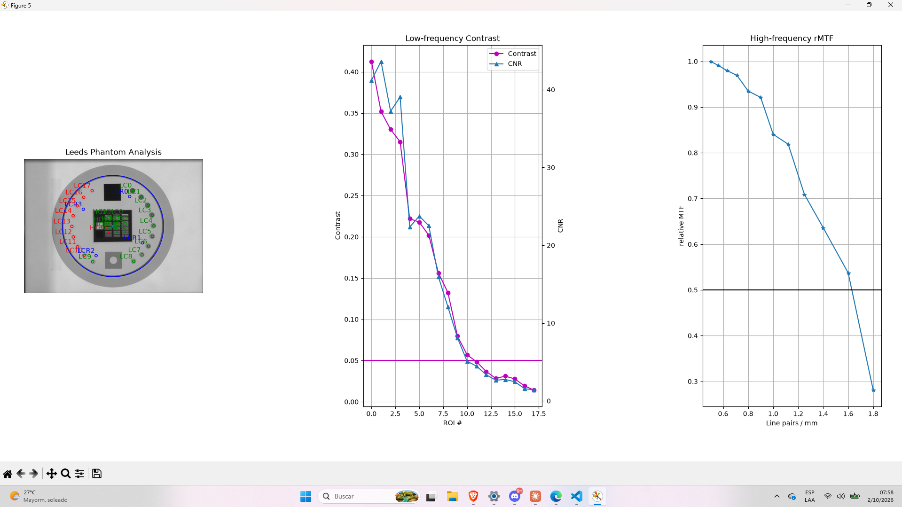
